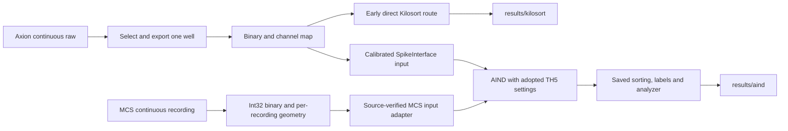

# Axion to MCS: workflow, decisions, and adaptation

Updated 2026-09-17. This is the implementation map for carrying the established
Axion spike-sorting workflow into the staged MCS chemogenetics archive. Its
boundary is continuous input -> Kilosort -> saved spikes, labels and analyzers.
It records completed Axion work, verified MCS inputs, and proposed MCS work
separately. The initial mapping did not launch sorting. Following user approval,
one complete MCS recording entered the established AIND route; see the
[single-recording execution note](MCS_SINGLE_RECORDING_RUN_20260917.md) for its
current status, exact paths, adaptations and validation. Phenotype cutoffs,
drug-response statistics and final figures are outside this adaptation task.

The processing unit changes from **one well extracted from a multiwell Axion
recording** to **one complete MCS recording of a single MEA**. This removes well
selection and plate splitting. It does not remove the need for calibration,
sorting analyzers, quality review, event alignment, or biological sample identity.
Multiple files can belong to the same biological sample; 114 recordings must not
be interpreted as 114 independent biological replicates.

## 0. The project README and the code behind its folders

The user-specified Mac path
`/Volumes/umms-parent/axion_mea_spiketurnpike_projectfolder/README.md` corresponds
here to `/nfs/turbo/umms-parent/axion_mea_spiketurnpike_projectfolder/README.md`.
That file identifies this source repository, describes the runtime directories,
and points to `docs/GREATLAKES_KILOSORT_HANDOFF.md`. It is the original storage
scaffold, not an executable pipeline or a complete description of later AIND
outputs. Both routes below live under that same project root.

| Runtime artifact | Code responsible | Role |
| --- | --- | --- |
| `data/interim/kilosort_binary/<recording>/<well>/` | `matlab/export_axion_well_kilosort_binary.m`, launched by `slurm/export_axion_well_binary.sbatch` | Extract continuous per-well voltage counts and channel mapping. Axion spike-list CSVs are not the continuous input to Kilosort. |
| `results/kilosort/<recording>/<well>/kilosort4/` | `slurm/run_kilosort_well.sbatch` -> `run_axion_kilosort.py` -> `src/axion_mea/kilosort_pipeline.py:run_kilosort4` | Earlier direct Kilosort route; readiness manifest/probe and native sorter files. Its code defaults still include threshold 9. |
| AIND input parameters/probe | `scripts/prepare_aind_well_batch.py` -> `scripts/prepare_aind_spikeinterface_well.py` | Wrap the same continuous binary as a calibrated SpikeInterface recording and attach per-well geometry and explicit TH5 parameters. |
| `results/aind/<recording>/<well>/` | `slurm/run_aind_nwb_well.sbatch` -> external `aind-ephys-pipeline/pipeline/main_multi_backend.nf` and staged AIND capsules | Mature TH5 route: sort, persist SpikeInterface spikes/labels, compute analyzers and collect outputs. |
| Recording/well batches and status | `scripts/prepare_aind_recording_batches.py`, `scripts/submit_next_step1_v5_ground_truth_wave.py`, `scripts/summarize_step1_v5_ground_truth.py` | Decide which inputs run, prepare/submit bounded waves, reconcile actual artifacts. |
| New MCS sorter inputs | `scripts/convert_mcs_msrd_archive.py` -> `scripts/prepare_mcs_sorting_inputs.py` | Decode/validate source acquisition, then export lossless int32 recording binaries and sidecars. |
| New MCS direct sorter | `run_mcs_kilosort.py` | Currently only readiness/native Kilosort execution; not yet equivalent to the mature saved-spike/analyzer workflow. |
| New MCS AIND adapter | `scripts/prepare_mcs_aind_recording.py` -> `slurm/run_aind_nwb_well.sbatch` in `spikeinterface` mode | Validates source XML, int32 channel order and gains; prepares one MEA recording for the same full AIND route under `results/aind_mcs/<group>/<condition>/<recording>/<run_id>/`. |



## 1. The Axion workflow actually used

The mature reference is the AIND/SpikeInterface **Step 1 TH5 v5** route, not only
the early direct `run_axion_kilosort.py` smoke test and not the original
spike-list-CSV response builder. The July 8 submission used 57 recording rows
and 454 per-well chains. This establishes the adopted configuration; it is not
evidence of a formal parameter sweep with a ranked winner.

| Stage | Axion inputs and decision | Outputs that matter | MCS adaptation |
| --- | --- | --- | --- |
| Inventory | Continuous `.raw`, structured filter metadata, plate type, spike sidecars, `.platemap`, biological annotations. Keep primary and filtered variants distinguishable. | Recording manifest, eligibility/reasons, source/filter provenance. | Keep `.msrd`/HDF5 lineage and full group/condition/recording hierarchy. Separate file readability from scientific inclusion. |
| Select processing units | Lumos v5: activity-selected wells OR active/labeled plate-map wells. CytoView: all six wells for included non-LFP raws. Exclude LFP and held BlockVector-warning files. | Explicit per-well job list. | One task per recording. No Axion well activity gate, artificial A1 identity, or multiwell plate expansion. |
| Continuous export | Axion loader extracts ordered channels from one well, normally the full recording; calibrated int16 counts and plate-specific geometry. | Binary, `channel_mapping.csv`, `binary_export_manifest.json`, interim NWB. | Already staged: int32 binary, `channels.csv`, `events.csv`, preparation JSON. Derive count and order per recording. |
| Ingestion bridge | Binary + ProbeInterface JSON became the working AIND/SpikeInterface input; intermediate NWB remained in the wrapper contract. Full AIND mode preserved custom preprocessing. | Calibrated recording, probe, reader parameters, environment/provenance. | Add an MCS recording/probe adapter. Do not pass MCS through `AxionWellMapping` or copy hardcoded Axion sample rate/dtype. |
| Preprocess and sort | Adopted TH5 parameters, Kilosort preprocessing enabled, CAR and motion correction disabled, plate-specific spatial settings. | Kilosort spikes/clusters/templates/labels, resolved settings and logs. | Carry the chosen detection behavior explicitly, then adapt geometry, sample timing, reference policy, and input filter description. |
| Step 1 postprocessing | Recording + sorting produce a SpikeInterface analyzer and curation-compatible sorting. Inspect persisted extensions rather than assuming every configured extension was saved. | `preprocessed/`, `spikesorted/`, `postprocessed/*.zarr`, `curated/`, `nwb/`, QC and processing records. | Reproduce saved spikes, labels, calibrated recording access and analyzer capabilities for each MCS recording. |
| Step 2 classification | Reopen existing analyzers; compute missing metrics/extensions for UnitRefine/Bombcell without redoing sorting. | Separate label CSVs, curation/merge JSON, metrics, classifier provenance and summary. | Optional separate stage. Retain sorter labels, automatic classifier labels and manual decisions as distinct fields. |
| Review | Inspect ready Step 1 analyzers in GUI and save external review decisions. | Traceable spikes, unit labels, waveform sources and manual curation. | Preserve recording IDs and event linkage; later scientific analyses consume these outputs. |

Evidence: [v5 selection and actual submission](KEMPNER_WORKFLOW_ADAPTATION_PLAN.md#2026-07-08-step-1-v5-manifest-policy-lumos-activity-or-plate-map),
`scripts/prepare_aind_well_batch.py`, `scripts/prepare_aind_spikeinterface_well.py`,
`slurm/run_aind_nwb_well.sbatch`, and
[downstream asset inventory](DOWNSTREAM_ANALYSIS_DATA_INVENTORY.md).

### Decisions to preserve, including their limits

1. **Use the adopted TH5 configuration.** The July 8 run used
   `config/aind_axion_lumos_params_th5_kilosort_preproc_DRAFT.json` and its
   CytoView counterpart despite `DRAFT` remaining in their filenames. The old
   9/8 threshold note is historical. The material change was `Th_universal: 9 -> 5`
   and `skip_kilosort_preprocessing: true -> false`.
2. **Preserve effective preprocessing provenance.** The active outer AIND
   custom pipeline was an int16 cast; Kilosort performed its own preprocessing.
   Default highpass/common-reference blocks also present in the JSON were not
   proof that those outer steps ran. Templates from an analyzer and Kilosort's
   internally processed templates are different waveform sources.
3. **Treat sparse failures separately.** The tested rescue reduced
   `n_templates`, `nearest_templates`, and `n_pcs` together to 2. It was an
   isolated fallback, not a replacement global baseline or proof that all v5
   sparse recordings were rescued.
4. **Distinguish completion from usable outputs.** Some Axion jobs completed
   without usable units/analyzers. Verify actual assets and unit counts, and
   distinguish valid zero-unit outcomes from missing or failed output.
5. **Keep Step 1, Step 2, and scientific inclusion separate.** Earlier frozen
   Step 2 results did not imply Step 2 completion for the later TH5 v5 cohort.
   UnitRefine/Bombcell were evaluated as domain-mismatched metadata rather than
   adopted as automatic replacements for Kilosort labels and independent QC.
6. **Preserve raw data and earlier outputs.** Use new run/output identities,
   saved settings, selection reasons and external manual curation; do not
   silently replace prior denominators or mix different sorting versions.
7. **Avoid scheduler deadlock.** Axion's nested AIND launch required small
   monitored waves because waiting parent jobs could occupy resources needed
   by their children. A direct MCS array is simpler only if it also supplies
   the required postprocessing and downstream outputs.

## 2. Verified MCS archive and experimental hierarchy

Staged input root:

```text
/nfs/turbo/umms-parent/axion_mea_spiketurnpike_projectfolder/data/interim/mcs_sorting_inputs
```

Existing raw archive/inventory root:

```text
/nfs/turbo/umms-parent/mea_multichannel_project/raw_data/MANNY_MEAs_chemogenetics
```

The existing handoff and readiness ledger already preserve the experimental
groups. The raw archive also contains `structure_report.txt`,
`folder_structure_breakdown.csv`, and `h5_inventory_breakdown.csv`. Use these
sources and source sidecars to recover metadata and retain their provenance.

| Existing group | Staged recordings | Existing condition hierarchy | Exported channels | Marker-bearing recordings |
| --- | ---: | --- | --- | --- |
| Actuators & Effectors | 60 | `Stim 1`, `Stim 2`, `Stim 4`, then numbered IDs such as `352.1`, `353.1`, `354.1`, `371.1`. | 36 with 59; 24 with 60 | 32 pulse; 16 chemical; 12 without markers |
| Actuators & Veh | 22 | Dated sample labels, including 353/354/371/D3 variants. | 59 | 18 pulse; 4 without markers |
| plain neurons & Effectors | 13 | `CNO1-3`, `CTZ1-3`, `NB1-3`, `PSEM1-3`. | 59 | 12 pulse; 1 without markers |
| MEA 2023 | 19 | Dated 353/354/371/D3 sample labels. Keep this separately identified collection. | 59 | 19 without markers |

Preserve these labels literally. A folder token alone is not a verified mapping
from a numbered ID to a construct, dose, donor, or independent replicate. Do not
merge dotted/hyphenated IDs across dates or equate a `Stim` folder number with
the number of pulses. The separate `lmc_spikes_crespoetal2023` workflow documents
Manny2TB `mea_blade_round3/4/5_led_ctz` data; its CTZ/VEH pairings are not a
verified crosswalk for this archive.

### Live structural audit, 2026-09-17

- Source audit: 118 acquisitions, 114 readable; 3 unreadable and 1 incomplete.
- Staging ledger: 116 history rows, 114 distinct latest recording rows; 113
  `prepared` and 1 `already_validated`. Historical failed int16 attempts do not
  create extra recordings.
- All 114 staged binaries exist and have the exact manifest-declared size:
  106,797,852,000 bytes total (99.46 GiB), int32, sample-major, 10,000 Hz.
- **90 exports have 59 channels; 24 have 60.** At source channel index 14,
  the former have `Ref` removed; the latter contain numeric label `15`.
  Preserve this distinction until source acquisition metadata establishes
  that site's physical role. Never truncate a 60-channel binary to 59 by
  changing `n_chan_bin`, or drop numeric channel 15 by assumption.
- Exported labels, source indices and coordinates are unique; channel rows
  match source label order, and event sidecars match their preparation JSON.
  These structural checks do not establish that the assigned pitch is correct.
- **Original acquisition XML contradicts universal 200 um geometry.** Of 35
  available MEA configuration XML files, 21 declare `60MEA200/30iR` with `Ref`
  at hardware ID 14, and 14 declare `60MEA100/10` with label `15` at that ID.
  The current exporter assigned 200 um spacing to both. Match XML to each exact
  recording, resolve the configured model against the actual array, and derive
  pitch from that evidence. Exact identity matching links 33 XML files to staged
  recordings: 19 configured 60MEA200 and 14 configured 60MEA100. The other 2 XML
  files correspond to unstaged blocked acquisitions; **81 staged recordings
  lack matching acquisition XML in this partial raw copy**. Do not infer their
  pitch from channel count. XML hardware ID 14 and exported source stream index
  14 are separate identifiers even though their labels coincide in these checks.
- All gains in the inspected manifests are `5.9605e-8 V/count`, or
  `0.059605 uV/count`. Gain arrays describe original source channels, so map
  gains using `stream_channel_index` even when the values happen to agree.
- Durations span 1.3-852.8 s; 7 recordings are shorter than the old AIND 30 s
  minimum. Readable/exported does not mean suitable for every analysis.
- Events: 550 pulse starts and 550 pulse stops across 62 recordings; 16
  recordings have one `Chemical START`; 36 have no hardware markers. All
  recorded relative times fall inside their recording duration.
- Every preparation manifest retains original `/Volumes/MannySSD/...`
  paths. Files exist in the staged directory, but the current runner trusts
  the obsolete absolute binary/channel paths.

Audit artifacts: [recording inventory](../audit-output/mcs_staged_inventory_20260917.csv)
and [summary/provenance](../audit-output/mcs_staged_audit_20260917.json).
Acquisition geometry evidence is recorded separately in
[source XML audit](../audit-output/mcs_source_geometry_20260917.csv).
The manufacturer's [standard 60MEA layout](https://www.multichannelsystems.com/sites/multichannelsystems.com/files/documents/data_sheets/Standard_60MEA_Layout.pdf)
documents the 100/200 um array variants and the site 15/reference distinction.
This supports interpreting the configured models; it does not independently
confirm which physical array was connected for an individual acquisition.
This was a metadata and file-size check, not a binary-content checksum,
signal-quality assessment, reference validation, or completed sorting test.

## 3. Parameter transfer ledger

These are proposed MCS choices and explicit review points, not results from an
MCS tuning run. The closest channel-count reference is CytoView, but it is not
the same geometry. Keep a versioned MCS configuration instead of importing the
Axion JSON verbatim.

| Setting | Adopted Axion behavior | MCS transfer decision |
| --- | --- | --- |
| Detection | `Th_universal=5`, `Th_learned=8`, `Th_single_ch=6` | Carry explicitly as the starting baseline. Current MCS runner omits these values. |
| Preprocessing | Kilosort preprocessing enabled, `highpass_cutoff=300`; outer custom cast only | Carry the Kilosort behavior, record source filter state and the waveform-extraction filter separately. Never inherit an unsupported `is_filtered=true`. |
| CAR/sign | `do_CAR=false`, `invert_sign=false` | Carry explicitly. Current MCS CAR default is true; inspect reference configuration and noise during validation. |
| Motion | `nblocks=0`, motion/correction disabled | Carry disabled as the starting policy. |
| Sample rate | Axion 12,500 Hz | Read actual metadata: staged MCS is 10,000 Hz. One MCS sample is 0.1 ms, not 0.08 ms. |
| Data type | Axion int16 export/cast | Keep lossless MCS int32 input. Use a calibrated floating-point analysis representation when processing requires it; do not cast these counts to int16. |
| Waveform window | `nt=31` at 12.5 kHz | Explicit review: 31 samples spans about 3.1 ms at MCS rate versus 2.48 ms at Axion rate. A roughly duration-matched candidate is 25 samples. Record the choice and inspect waveform coverage before locking it. |
| Geometry | Lumos 16 contacts at 350 um; CytoView 64 at 300 um | One MCS array per recording. Source XML identifies both 60MEA200 and 60MEA100 configurations; correct pitch/reference metadata before choosing distances. Staged coordinates alone are not authoritative because export hardcoded 200 um. |
| Spatial neighborhood | Lumos/CytoView max distance 400/350 um, nearest channels 5, min template size 50 | Keep prior values in the transfer ledger; choose MCS spatial distances after geometry reconciliation. Existing MCS distance 400 um is not a tested MCS decision. |
| Whitening/templates | Lumos 8/16 and CytoView 16/64 for whitening range/nearest templates; standard `n_templates=6`, `n_pcs=6` | Evaluate a CytoView-derived 16/64 baseline against the actual MCS map. Current MCS nearest templates 16 is not evidence of a prior MCS choice. Persist the full resolved settings. |
| Batch size | `batch_size=15000` | Carry explicitly initially; note 1.5 s at 10 kHz versus 1.2 s at 12.5 kHz. Handle short records explicitly. |
| Sparse rescue | Isolated 2/2/2 templates/nearest templates/PCs | Only for diagnosed sparse initialization failures, with a distinct run ID and provenance. Do not apply to every recording. |

Reference configurations:
[Lumos TH5](../config/aind_axion_lumos_params_th5_kilosort_preproc_DRAFT.json),
[CytoView TH5](../config/aind_axion_cytoview6_params_th5_kilosort_preproc_DRAFT.json).
Geometry candidates and timing choices above require validation; preserving the
prior decision does not mean claiming the same numerical settings were tested
on MCS.

## 4. MCS input and output contracts

### How Axion spikes were handled after Kilosort

These output representations serve different purposes:

| Representation | Location/content | Meaning |
| --- | --- | --- |
| Native Kilosort | Early direct runs: `results/kilosort/<recording>/<well>/kilosort4/` with `spike_times.npy`, `spike_clusters.npy`, `spike_templates.npy`, `templates.npy`, `amplitudes.npy`, `cluster_KSLabel.tsv`, `cluster_ContamPct.tsv`, `channel_map.npy`, `channel_positions.npy`, `ops.npy` and logs. | Spike sample positions, cluster assignments, sorter properties and internal template/probe/settings data. These are not an analyzer's calibrated mean waveforms. |
| Saved SpikeInterface sorting | Mature runs: `results/aind/<recording>/<well>/spikesorted/block0_None_recording1/` and `curated/block0_None_recording1/`. Contains `spikes.npy`, `numpysorting_info.json`, and properties including `KSLabel`, `ContamPct`, `Amplitude`, `original_cluster_id`. | Reloadable unit spike trains, original cluster provenance and properties. The curated and initial sorting need not contain the same units. |
| SortingAnalyzer | `results/aind/<recording>/<well>/postprocessed/block0_None_recording1.zarr` | Sorting plus recording access and computed extensions. Representative inspected outputs persisted `random_spikes`, `templates` and `correlograms`; inspect each analyzer for additional extensions. |

In the staged AIND implementation, the Kilosort capsule calls
`spikeinterface.sorters.run_sorter`, removes empty units, removes spikes beyond
the recording's sample bounds, and saves the SpikeInterface sorting. It also
deletes the native `sorter_output` directory after reading it. Thus the mature
Axion route's durable spike output is the saved SpikeInterface sorting, not a
guarantee that every native Kilosort array remains in the final result folder.
Preserving native arrays in a new MCS run would be an explicit provenance
improvement to that behavior.

The adopted configuration sets `keep_good_only=false`: sorting is not restricted
to the later analysis's good-unit subset at this point. It also sets
`duplicate_spike_ms=0.25` inside Kilosort. Separately, the AIND postprocessing
capsule invokes `remove_redundant_units` with `duplicate_threshold=0.9`, then
creates the saved analyzer from that reduced sorting. These are different
operations: duplicate detections within a unit versus redundant units.

Track input/output spike and unit counts at every transformation. Preserve a
unit-ID crosswalk for removals/merges; do not assume a vector's row number or
SpikeInterface's internal unit index is the original Kilosort cluster ID.
Convert sample indices to relative seconds using the recording's actual sample
rate. Preserve absolute/source timestamps separately; do not shift spikes to a
stimulus origin in the canonical sorting.

The external implementation files inspected are under
`<PROJECT_ROOT>/aind_capsule_repos/`:

- `aind-ephys-spikesort-kilosort4/code/run_capsule.py`: sorter call, native-output
  cleanup, empty-unit/out-of-range cleanup and sorting persistence.
- `aind-ephys-postprocessing/code/run_capsule.py`: redundant-unit removal,
  calibrated analyzer construction and Zarr persistence.
- `aind-ephys-curation/code/run_capsule.py`: optional classifier labels and
  proposed removals/merges. Missing quality/template metrics can cause this
  classification stage to skip with placeholder output.
- `aind-ephys-results-collector/code/run_capsule.py`: attaches classifier labels
  when their row count matches analyzer units, saves `analyzer.sorting` into
  `curated/`, and copies the curation JSON. In this inspected implementation it
  does **not** apply the JSON's recommended noise removals or merges to that
  saved sorting. `curated/` therefore means the postprocessing-deduplicated
  sorting with available labels/recommendations, not proof those recommendations
  were applied. Label CSV row order must also match unit identity; matching row
  counts alone cannot establish identity.

Step 2 classifier recommendations and later scientific inclusion remain
separate. Do not describe `curated/` as proof of manual review or assume
UnitRefine/Bombcell classifications were universally applied to the TH5 cohort.

### Identity and metadata

One stable `recording_id` should derive from the complete staged relative path:
`<experimental_group>/<condition_path>/<recording_stem>`. Keep separate fields
for source group/condition, acquisition time, source lineage, biological
`sample_id`, treatment, session, and repeat/pair identity when source records
establish them. Record assignment source and unresolved fields. `unit_id` is
scoped to `(recording_id, sorting_run_id)`; identical cluster numbers in two
files do not establish the same neuron.

Keep `MEA 2023` identified as a separate collection. Keep incomplete/unreadable
source rows visible with reasons. Analysis-specific exclusions and repeated
observations must survive into exported tables and reported denominators.

### Recording contract

Consume existing `mcs_signal_channels.int32.bin`, `channels.csv`, `events.csv`,
and `mcs_preparation_manifest.json`; resolve runtime files under the supplied
input directory while retaining original source paths as provenance. Validate
exact bytes against declared samples, channel count and dtype, not only file
size divisibility.

Each binary channel needs its binary index, source stream index, MCS label,
acquisition array model, geometry source, x/y coordinate, reference status and
gain in uV/count. Attach one physical MEA
probe to a calibrated SpikeInterface recording. Channel order must agree across
the binary, geometry, gains, sorter, analyzer and exported tables. Capture source
filtering and timestamp continuity before making a continuous-recording claim.
Corrected geometry belongs in a versioned derived probe/channel manifest with
its acquisition-metadata source. Changing pitch does not require rewriting the
continuous binary; preserve both the staged sidecar and the corrected mapping.

### Sorter and analyzer contract

The earlier handoff proposed `results/kilosort/mcs_60mea200/`; because acquisition
metadata now identifies more than one configured model, use a geometry-neutral
MCS output namespace (for example `results/mcs/<group>/<condition>/<recording>/<run_id>/`)
and store the model per recording. This is a proposed naming change, not an
existing output directory or relocation of earlier runs.
Use corresponding run-scoped MCS analyzer, QC and analysis directories; output
locations should not require fictitious well names.

Required products for the complete adapted workflow:

- A run manifest with source IDs, current paths, code commit, package versions,
  complete effective parameters, geometry/gain map, input dimensions, timing,
  filtering, run status and any fallback reason.
- Original Kilosort outputs and a reloadable SpikeInterface sorting. Preserve
  all cluster labels/properties; scientific inclusion is a later decision.
- A reloadable calibrated recording and `SortingAnalyzer`, with sampled spikes,
  templates, amplitudes, correlograms, unit locations and explicitly requested
  waveform/quality metrics. Save extraction windows, seeds, gains and filters.
- QC tables and review figures for noise, waveform shape, spatial footprint,
  short ISIs, firing-rate stability and stimulus artifacts. Store optional
  UnitRefine/Bombcell results and manual decisions independently.
- Recording/unit/spike/channel/event tables plus per-MEA summaries. Persist
  sample indices and relative seconds for spikes; keep Kilosort unit identity
  traceable through every join.
- NWB with calibrated electrode/recording metadata, units and stimulus/event
  timing if retaining the Axion archival/interchange deliverable. An NWB file
  alone does not replace the analyzer used by the review tools.

Reuse the AIND or SpikeInterface implementation behind these capabilities.
The current direct MCS runner only prepares/runs Kilosort; it does not already
produce this complete contract. Whether orchestration uses AIND or a direct
single-recording runner should not change the data available downstream.

### Event and experimental-response contract

Keep raw event ID, label, timestamp and recording-relative time. Add normalized
event kind, onset/offset and annotation provenance without replacing raw events.
Pulse starts and stops are separate edges, not two independent stimuli.

Route analyses by actual experiment metadata and events:

- Pulse markers: validate pulse/train structure and stimulus artifacts before
  raster/PSTH and response metrics. `STG` alone does not establish optical
  stimulation, nor that the Axion optotag windows or 250-pulse rules apply.
- Chemical markers: align treatment-response windows to the verified chemical
  event, preserving treatment/dose/session metadata and available baseline.
- No hardware markers: retain spontaneous analysis eligibility. Consult source
  annotations/sidecars before chemical or stimulus-locked analysis; absence of
  a hardware event is not evidence of an untreated control.

Never substitute a fixed 300 s onset because some recordings have events near
that time. Define baseline/post windows per protocol and available data. Keep
within-recording pre/post measurements distinct from paired recordings of a
sample on different dates.

## 5. Boundary with downstream analysis

This task ends with reproducible sorted spikes, unit properties, geometry,
calibrated waveform/analyzer access and preserved events. Later FS/RS cutoffs,
drug-response windows, bursts, biological pooling and final-figure exclusions
do not determine which input is sent to Kilosort. Keep those downstream choices
separate so the same saved sorting can support more than one analysis without
rerunning or silently changing spike sorting.

## 6. Implementation sequence and acceptance checks

This is the archive-wide acceptance sequence, not a claim that all MCS input
classes have been implemented or validated. The one-recording execution note
above records the bounded implementation and actual results separately.

| Order | Work | Acceptance evidence |
| --- | --- | --- |
| 1 | Recording manifest and portable input resolver | All 114 source identities reconciled to local staged assets; no Mac paths required at runtime; exact binary dimensions; four blocked sources retained separately. |
| 2 | Geometry, reference, calibration and metadata adapter | 59/60 channel cohorts and 100/200 um configured geometries reconciled per recording, source slot 14 resolved from acquisition evidence, channel/gain order verified, no fabricated wells. |
| 3 | Explicit MCS TH5 config and dry-run readiness | Adopted thresholds/CAR/preprocessing explicit; dtype int32; timing/spatial choices versioned; short recordings get documented eligibility; no GPU execution needed. |
| 4 | One representative recording end to end | Sorter output reloads, calibrated analyzer opens in GUI, spikes/events share an origin, waveform/filter provenance recorded, outputs distinguish zero units from failure. |
| 5 | Coverage of distinct input classes | Validate both channel-map cohorts once reference roles are established and cover pulse, chemical and event-free recordings; do not let one example stand for all formats. |
| 6 | Bounded archive scheduling | One recording per task; immutable per-task status records aggregated into a ledger without concurrent CSV-write races; resume only verified matching outputs. |
| 7 | Spike/output reconciliation | Native and saved sorting unit/spike counts reconcile with every removal/merge logged; labels and events retain identity, analyzer reloads from durable traces, earlier runs retained. |

Meaningful implementation tests should cover relocated paths, int32 extreme
values, 59/60 channel identity, per-source-index gains, truncated binaries,
settings propagation, empty/mixed events, and sample-rate-correct timing.
GPU validation should assess usable sorting/analyzer output and artifacts, not
merely process exit status.

## 7. Current gaps in the MCS implementation

| Code | Gap |
| --- | --- |
| `run_mcs_kilosort.py` | Reads obsolete absolute sidecar paths; omits adopted thresholds and full effective-setting provenance; enables CAR by default; does not validate sample count against manifest; no analyzer/QC/event export stage. |
| `src/axion_mea/io/mcs_h5.py` | Excludes literal `Ref` only, retains original-channel gain arrays, permits insufficiently validated geometry; first timestamp alone does not validate time continuity. |
| `run_mcs_h5_prepare.py` and legacy binary export | Direct single-file binary export defaults to int16; the staged archive preparation correctly used int32. Do not rerun that old pilot path on this archive. |
| Axion batch/reader wrappers | Assume wells, Axion mappings, 12.5 kHz, int16 and filtered input; not an MCS adapter. |
| Axion downstream scripts | Several embed plate biology, fixed sampling rates, paths or selected units. Reuse algorithms through a neutral recording/unit/event interface, not by changing filenames only. |

These describe the older direct/legacy paths, which remain unchanged. The new
source-verified MCS AIND adapter bypasses their sorting limitations for eligible
recordings. One canary does not resolve the archive-wide geometry, timing and
metadata checks in this map.
